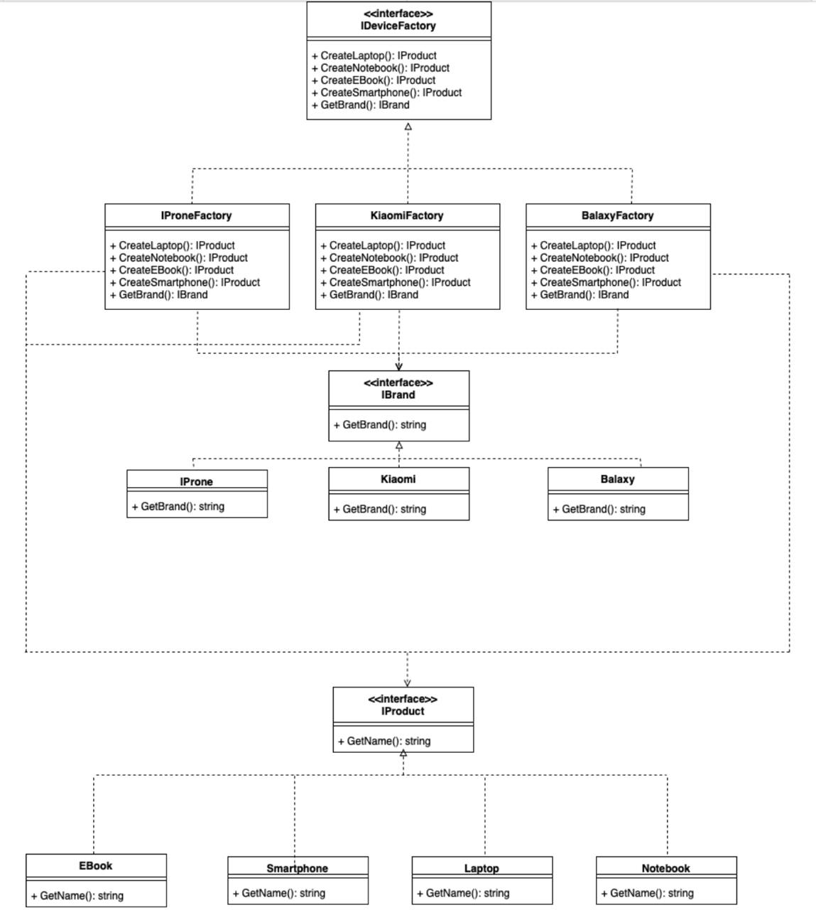
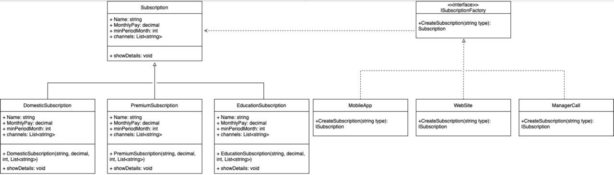
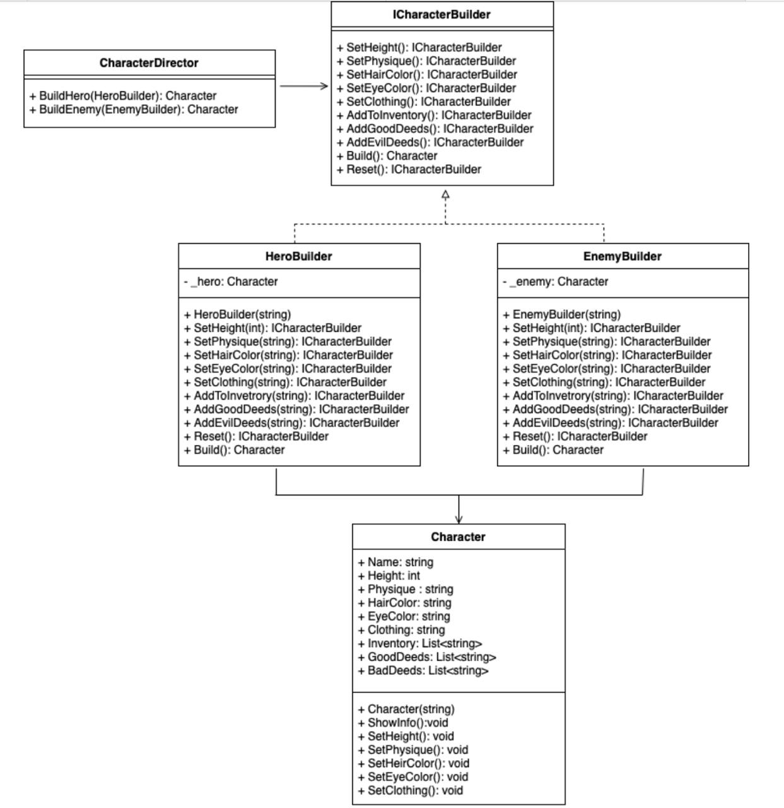

# Lab2

## Abstract Factory
The Abstract Factory pattern provides an interface for creating families of related or dependent objects without specifying their concrete classes.

## Factory
The Factory pattern defines an interface for creating an object but allows subclasses to alter the type of objects that will be created.

## Singleton
The Singleton pattern ensures that a class has only one instance and provides a global access point to it.

## Prototype
The Prototype pattern allows cloning of objects, creating new instances by copying an existing one instead of instantiating from scratch.

## Builder
The Builder pattern separates the construction of a complex object from its representation, allowing the same construction process to create different representations.

